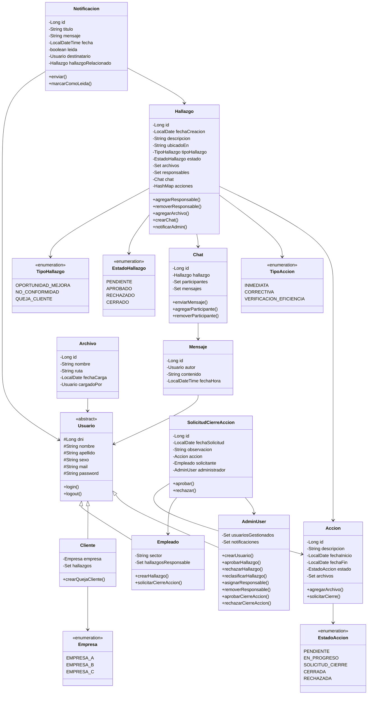

```mermaid
classDiagram

%% =========================
%% USUARIOS
%% =========================

class Usuario {
    <<abstract>>

    #Long dni
    #String nombre
    #String apellido
    #String sexo
    #String mail
    #String password

    +login()
    +logout()
}

class Empleado {
    -String sector
    -Set<Hallazgo> hallazgosResponsable

    +crearHallazgo()
    +solicitarCierreAccion()
}

class Cliente {
    -Empresa empresa
    -Set<Hallazgo> hallazgos

    +crearQuejaCliente()
}

class AdminUser {
    -Set<Usuario> usuariosGestionados
    -Set<Notificacion> notificaciones

    +crearUsuario()
    +aprobarHallazgo()
    +rechazarHallazgo()
    +reclasificarHallazgo()
    +asignarResponsable()
    +removerResponsable()
    +aprobarCierreAccion()
    +rechazarCierreAccion()
}

Usuario <|-- Empleado
Usuario <|-- Cliente
Usuario <|-- AdminUser

%% =========================
%% EMPRESA
%% =========================

class Empresa {
    <<enumeration>>

    EMPRESA_A
    EMPRESA_B
    EMPRESA_C
}

%% =========================
%% HALLAZGOS
%% =========================

class Hallazgo {
    -Long id
    -LocalDate fechaCreacion
    -String descripcion
    -String ubicadoEn

    -TipoHallazgo tipoHallazgo
    -EstadoHallazgo estado

    -Set<Archivo> archivos

    -Set<Usuario> responsables

    -Chat chat

    -HashMap<TipoAccion, Accion> acciones

    +agregarResponsable()
    +removerResponsable()
    +agregarArchivo()
    +crearChat()
    +notificarAdmin()
}

class TipoHallazgo {
    <<enumeration>>

    OPORTUNIDAD_MEJORA
    NO_CONFORMIDAD
    QUEJA_CLIENTE
}

class EstadoHallazgo {
    <<enumeration>>

    PENDIENTE
    APROBADO
    RECHAZADO
    CERRADO
}

%% =========================
%% CHAT
%% =========================

class Chat {
    -Long id

    -Hallazgo hallazgo

    -Set<Usuario> participantes

    -Set<Mensaje> mensajes

    +enviarMensaje()
    +agregarParticipante()
    +removerParticipante()
}

class Mensaje {
    -Long id
    -Usuario autor
    -String contenido
    -LocalDateTime fechaHora
}

%% =========================
%% ACCIONES
%% =========================

class Accion {
    -Long id

    -String descripcion

    -LocalDate fechaInicio
    -LocalDate fechaFin

    -EstadoAccion estado

    -Set<Archivo> archivos

    +agregarArchivo()
    +solicitarCierre()
}

class TipoAccion {
    <<enumeration>>

    INMEDIATA
    CORRECTIVA
    VERIFICACION_EFICIENCIA
}

class EstadoAccion {
    <<enumeration>>

    PENDIENTE
    EN_PROGRESO
    SOLICITUD_CIERRE
    CERRADA
    RECHAZADA
}

%% =========================
%% SOLICITUD CIERRE
%% =========================

class SolicitudCierreAccion {
    -Long id

    -LocalDate fechaSolicitud
    -String observacion

    -Accion accion

    -Empleado solicitante

    -AdminUser administrador

    +aprobar()
    +rechazar()
}

%% =========================
%% ARCHIVOS
%% =========================

class Archivo {
    -Long id

    -String nombre
    -String ruta

    -LocalDate fechaCarga

    -Usuario cargadoPor
}

%% =========================
%% NOTIFICACIONES
%% =========================

class Notificacion {
    -Long id

    -String titulo
    -String mensaje

    -LocalDateTime fecha

    -boolean leida

    -Usuario destinatario

    -Hallazgo hallazgoRelacionado

    +enviar()
    +marcarComoLeida()
}

%% =========================
%% RELACIONES
%% =========================

Cliente --> Empresa

Hallazgo --> TipoHallazgo
Hallazgo --> EstadoHallazgo

Hallazgo --> Chat

Hallazgo --> TipoAccion
Hallazgo --> Accion

Accion --> EstadoAccion

SolicitudCierreAccion --> Accion
SolicitudCierreAccion --> Empleado
SolicitudCierreAccion --> AdminUser

Archivo --> Usuario

Notificacion --> Usuario
Notificacion --> Hallazgo

Chat --> Mensaje
Mensaje --> Usuario
```