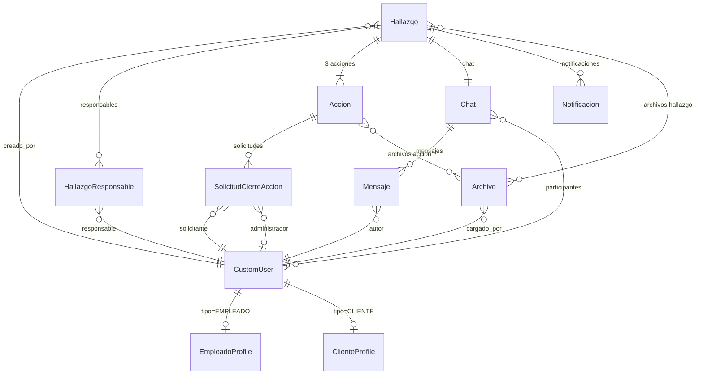

# Data Model: Sistema de Gestión de Hallazgos y Acciones Correctivas

**Branch**: `001-gestion-hallazgos` | **Date**: 2026-06-16

## Entities

---

### CustomUser

Modelo base de usuario. Extiende `AbstractUser` de Django.

| Campo       | Tipo           | Restricciones                          |
|-------------|----------------|----------------------------------------|
| `id`        | BigAutoField   | PK                                     |
| `dni`       | BigIntegerField | UNIQUE, NOT NULL                      |
| `nombre`    | CharField(100) | NOT NULL                               |
| `apellido`  | CharField(100) | NOT NULL                               |
| `sexo`      | CharField(1)   | choices: M / F / O; NOT NULL          |
| `email`     | EmailField     | NOT NULL                               |
| `password`  | CharField      | hashed (Django); NOT NULL             |
| `tipo`      | CharField(10)  | choices: ADMIN / EMPLEADO / CLIENTE; NOT NULL |
| `is_active` | BooleanField   | default True                           |

**Validation rules**:
- `dni` debe ser único en todo el sistema (FR-003).
- Solo `ADMIN` puede crear otros usuarios (FR-001).

**Relationships**:
- `EmpleadoProfile` (1:1 optional — present when `tipo = EMPLEADO`)
- `ClienteProfile` (1:1 optional — present when `tipo = CLIENTE`)

---

### EmpleadoProfile

| Campo    | Tipo          | Restricciones          |
|----------|---------------|------------------------|
| `id`     | BigAutoField  | PK                     |
| `user`   | OneToOneField → CustomUser | NOT NULL, on_delete CASCADE |
| `sector` | CharField(100) | NOT NULL              |

---

### ClienteProfile

| Campo    | Tipo          | Restricciones          |
|----------|---------------|------------------------|
| `id`     | BigAutoField  | PK                     |
| `user`   | OneToOneField → CustomUser | NOT NULL, on_delete CASCADE |
| `empresa`| CharField(50) | choices: EMPRESA_A / EMPRESA_B / EMPRESA_C; NOT NULL |

---

### Hallazgo

| Campo           | Tipo           | Restricciones                                    |
|-----------------|----------------|--------------------------------------------------|
| `id`            | BigAutoField   | PK                                               |
| `descripcion`   | TextField      | NOT NULL                                         |
| `fecha_creacion`| DateField      | auto_now_add; NOT NULL                           |
| `ubicacion`     | CharField(200) | NOT NULL                                         |
| `tipo`          | CharField(25)  | choices: NO_CONFORMIDAD / OPORTUNIDAD_MEJORA / QUEJA_CLIENTE; NOT NULL |
| `estado`        | CharField(20)  | choices: PENDIENTE / APROBADO / RECHAZADO / CERRADO; NOT NULL; default PENDIENTE |
| `creado_por`    | ForeignKey → CustomUser | NOT NULL, on_delete PROTECT               |

**Validation rules**:
- Empleados solo pueden crear `NO_CONFORMIDAD` y `OPORTUNIDAD_MEJORA` (FR-004).
- Clientes solo pueden crear `QUEJA_CLIENTE` (FR-005).
- Hallazgos de Empleados comienzan en `PENDIENTE` (FR-006).
- `QUEJA_CLIENTE` comienza directamente en `APROBADO` (FR-007).
- `RECHAZADO` es estado terminal; no puede reactivarse (aclaración spec).
- `CERRADO` se alcanza automáticamente cuando sus 3 acciones están `CERRADA` (FR-022).
- Admin reclasificar solo cambia `tipo`; estado permanece `PENDIENTE` (FR-009).

**State transitions**:
```
PENDIENTE  → APROBADO   (Admin)
PENDIENTE  → RECHAZADO  (Admin — terminal)
PENDIENTE  → PENDIENTE  (Admin reclasifica tipo)
APROBADO   → CERRADO    (automático por signal)
```

**Relationships**:
- `responsables`: ManyToMany → CustomUser (through `HallazgoResponsable`)
- `archivos`: ManyToMany → Archivo
- `chat`: OneToOne → Chat (auto-creado al crear Hallazgo)
- `acciones`: OneToMany → Accion (exactamente 3: INMEDIATA, CORRECTIVA, VERIFICACION_EFICIENCIA)
- `notificaciones`: OneToMany → Notificacion

---

### HallazgoResponsable

Tabla intermedia explícita para registrar asignación de responsables.

| Campo          | Tipo         | Restricciones                                      |
|----------------|--------------|----------------------------------------------------|
| `id`           | BigAutoField | PK                                                 |
| `hallazgo`     | ForeignKey → Hallazgo | NOT NULL, on_delete CASCADE              |
| `responsable`  | ForeignKey → CustomUser | NOT NULL, on_delete CASCADE            |
| `fecha_asignacion` | DateTimeField | auto_now_add; NOT NULL                      |

**Constraint**: `UNIQUE(hallazgo, responsable)` — asignación duplicada ignorada con aviso (FR-027).

---

### Accion

| Campo           | Tipo          | Restricciones                                              |
|-----------------|---------------|------------------------------------------------------------|
| `id`            | BigAutoField  | PK                                                         |
| `hallazgo`      | ForeignKey → Hallazgo | NOT NULL, on_delete CASCADE                      |
| `tipo`          | CharField(30) | choices: INMEDIATA / CORRECTIVA / VERIFICACION_EFICIENCIA; NOT NULL |
| `descripcion`   | TextField     | nullable                                                   |
| `fecha_inicio`  | DateField     | nullable                                                   |
| `fecha_fin`     | DateField     | nullable                                                   |
| `estado`        | CharField(20) | choices: PENDIENTE / EN_PROGRESO / SOLICITUD_CIERRE / CERRADA; NOT NULL; default PENDIENTE |

**Validation rules**:
- Cada Hallazgo tiene exactamente 1 Accion por `tipo` (UNIQUE constraint `hallazgo` + `tipo`) (FR-014).
- Solo responsables vigentes del Hallazgo pueden modificar/solicitar cierre (FR-015, FR-016).
- `CERRADA` solo vía aprobación explícita del Admin (FR-018).
- Rechazo de solicitud de cierre vuelve a `EN_PROGRESO` (FR-019).

**State transitions**:
```
PENDIENTE        → EN_PROGRESO      (Empleado actualiza descripción/fechas)
EN_PROGRESO      → SOLICITUD_CIERRE (Empleado solicita cierre)
SOLICITUD_CIERRE → CERRADA          (Admin aprueba)
SOLICITUD_CIERRE → EN_PROGRESO      (Admin rechaza)
```

**Relationships**:
- `archivos`: ManyToMany → Archivo
- `solicitudes_cierre`: OneToMany → SolicitudCierreAccion

---

### SolicitudCierreAccion

| Campo            | Tipo          | Restricciones                              |
|------------------|---------------|--------------------------------------------|
| `id`             | BigAutoField  | PK                                         |
| `accion`         | ForeignKey → Accion | NOT NULL, on_delete CASCADE          |
| `solicitante`    | ForeignKey → CustomUser | NOT NULL, on_delete PROTECT      |
| `administrador`  | ForeignKey → CustomUser | nullable, on_delete SET_NULL     |
| `fecha_solicitud`| DateTimeField | auto_now_add; NOT NULL                     |
| `observacion`    | TextField     | nullable                                   |
| `estado`         | CharField(20) | choices: PENDIENTE / APROBADA / RECHAZADA; NOT NULL; default PENDIENTE |
| `fecha_resolucion`| DateTimeField | nullable                                  |

**Validation rules**:
- Solo se puede tener 1 solicitud activa (`PENDIENTE`) por Accion en simultáneo.
- Solo el Admin puede aprobar/rechazar (FR-017).

---

### Chat

| Campo     | Tipo         | Restricciones                                      |
|-----------|--------------|----------------------------------------------------|
| `id`      | BigAutoField | PK                                                 |
| `hallazgo`| OneToOneField → Hallazgo | NOT NULL, on_delete CASCADE        |

**Validation rules**:
- Solo responsables vigentes del Hallazgo son participantes (FR-012).
- Al remover un responsable, se elimina del chat automáticamente (FR-013).

**Relationships**:
- `participantes`: ManyToMany → CustomUser (sincronizado con `Hallazgo.responsables`)
- `mensajes`: OneToMany → Mensaje

---

### Mensaje

| Campo      | Tipo          | Restricciones                              |
|------------|---------------|--------------------------------------------|
| `id`       | BigAutoField  | PK                                         |
| `chat`     | ForeignKey → Chat | NOT NULL, on_delete CASCADE            |
| `autor`    | ForeignKey → CustomUser | NOT NULL, on_delete PROTECT      |
| `contenido`| TextField     | NOT NULL                                   |
| `fecha_hora`| DateTimeField | auto_now_add; NOT NULL                   |

**Validation rules**:
- Solo participantes vigentes del Chat pueden enviar mensajes (FR-012).
- El historial se conserva aunque un responsable sea removido; solo pierde acceso futuro.

---

### Archivo

| Campo        | Tipo          | Restricciones                                      |
|--------------|---------------|----------------------------------------------------|
| `id`         | BigAutoField  | PK                                                 |
| `nombre`     | CharField(255)| NOT NULL                                           |
| `ruta`       | FileField     | upload_to configurable; NOT NULL                   |
| `fecha_carga`| DateTimeField | auto_now_add; NOT NULL                             |
| `cargado_por`| ForeignKey → CustomUser | NOT NULL, on_delete PROTECT            |
| `tipo_mime`  | CharField(100)| NOT NULL                                           |
| `tamaño`     | PositiveIntegerField | NOT NULL (bytes)                            |

**Validation rules**:
- `tipo_mime` debe estar en `ALLOWED_FILE_TYPES` (settings, no hardcodeado) (FR — Assumptions).
- `tamaño` ≤ `MAX_FILE_SIZE` (settings, no hardcodeado).
- Tipos permitidos: application/pdf, image/jpeg, image/png, image/gif, application/msword, application/vnd.openxmlformats-officedocument.wordprocessingml.document, application/vnd.ms-excel, application/vnd.openxmlformats-officedocument.spreadsheetml.sheet, application/vnd.ms-powerpoint, application/vnd.openxmlformats-officedocument.presentationml.presentation.

---

### Notificacion

| Campo               | Tipo          | Restricciones                              |
|---------------------|---------------|--------------------------------------------|
| `id`                | BigAutoField  | PK                                         |
| `titulo`            | CharField(200)| NOT NULL                                   |
| `mensaje`           | TextField     | NOT NULL                                   |
| `fecha`             | DateTimeField | auto_now_add; NOT NULL                     |
| `leida`             | BooleanField  | default False                              |
| `destinatario`      | ForeignKey → CustomUser | NOT NULL, on_delete CASCADE      |
| `hallazgo_relacionado`| ForeignKey → Hallazgo | nullable, on_delete SET_NULL       |

**Validation rules**:
- Generada automáticamente al crear cualquier Hallazgo (FR-008).
- Generada cuando un Empleado solicita cierre de acción (FR-016 + FR-017).
- Destinatario siempre es el Admin en esta versión.

---

## Entity Relationship Diagram



---

## Constraints Summary

| Constraint | Description |
|------------|-------------|
| `UNIQUE(CustomUser.dni)` | FR-003: DNI único en el sistema |
| `UNIQUE(HallazgoResponsable.hallazgo, HallazgoResponsable.responsable)` | FR-027: Sin responsables duplicados |
| `UNIQUE(Accion.hallazgo, Accion.tipo)` | FR-014: Exactamente 1 acción por tipo por hallazgo |
| `Hallazgo.estado = RECHAZADO` terminal | Estado RECHAZADO irreversible |
| `SolicitudCierreAccion` activa única | Solo 1 solicitud PENDIENTE por Accion |
